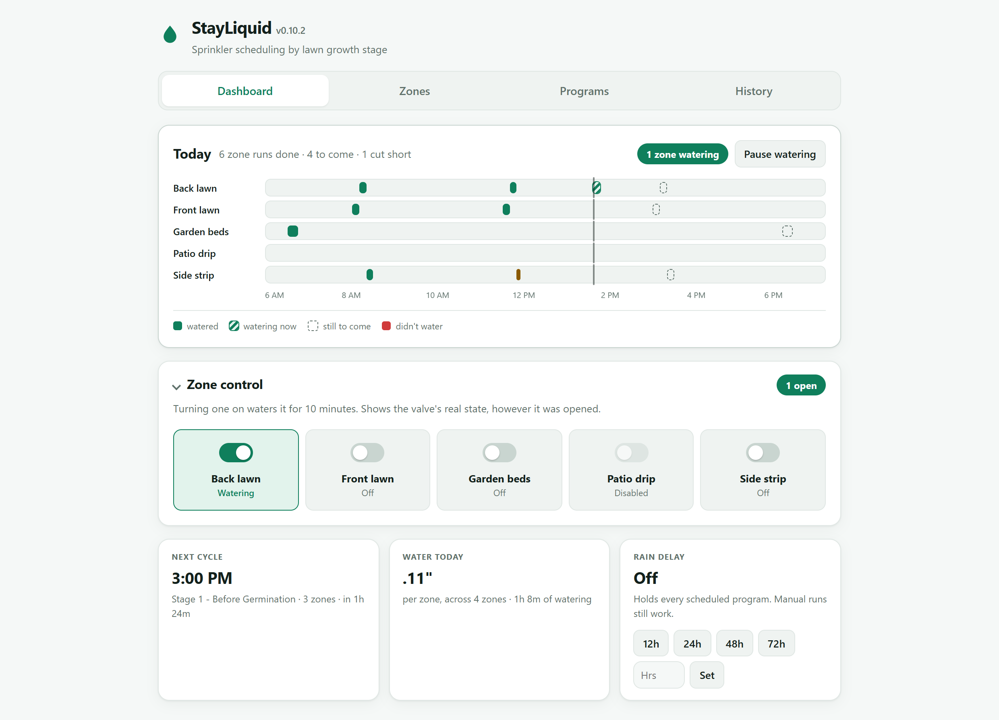
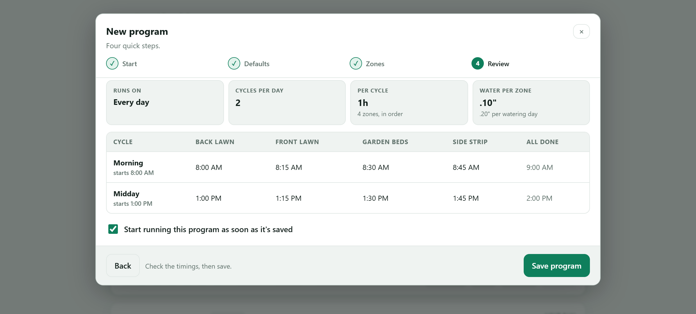
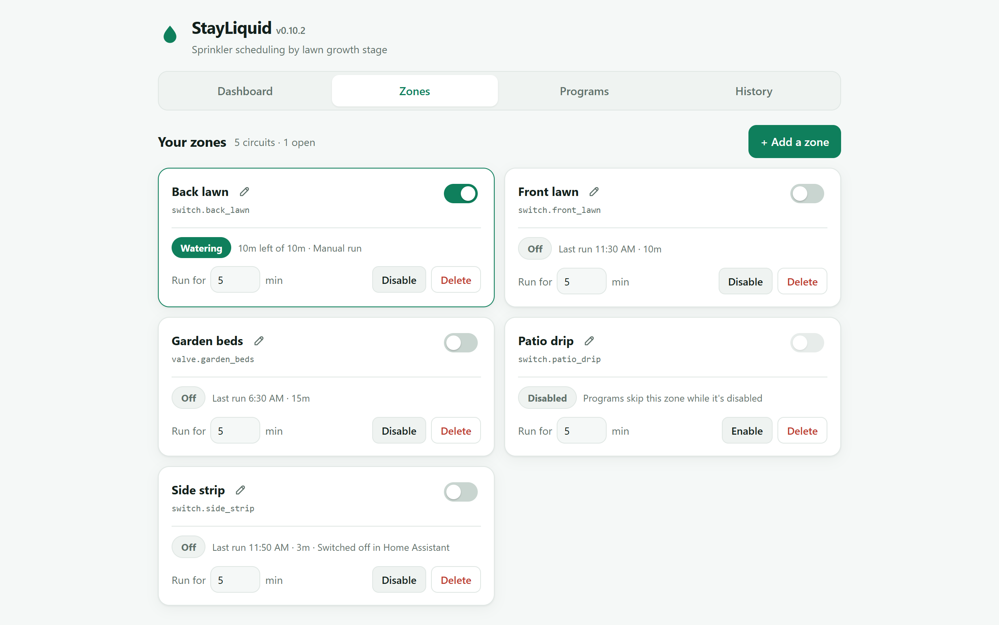
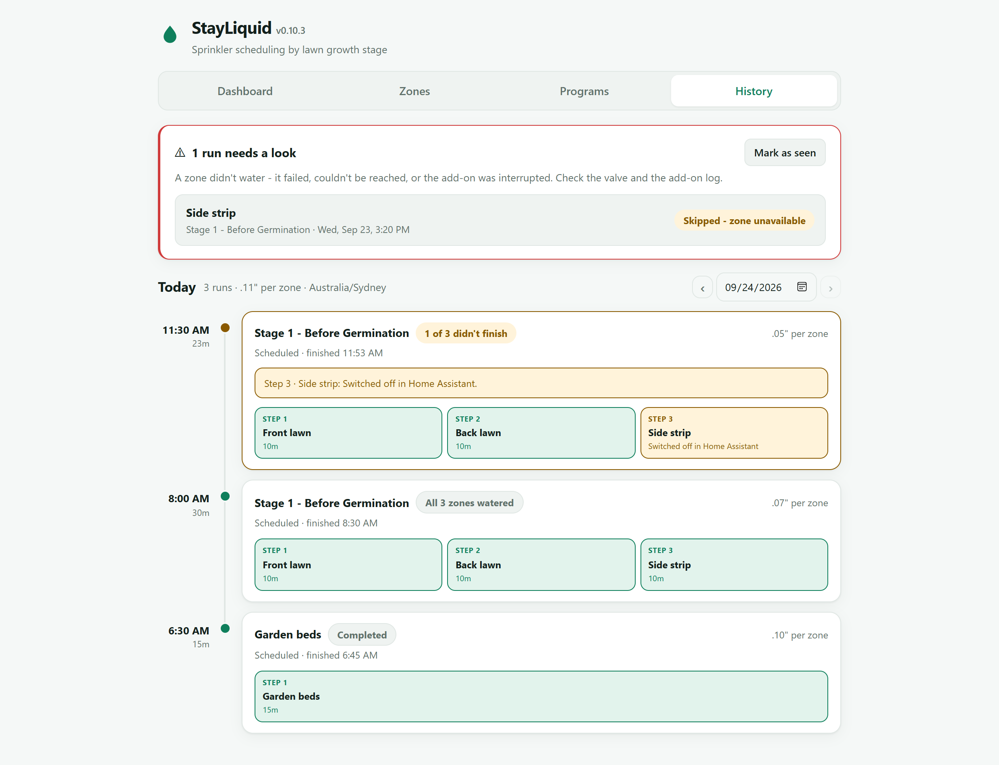
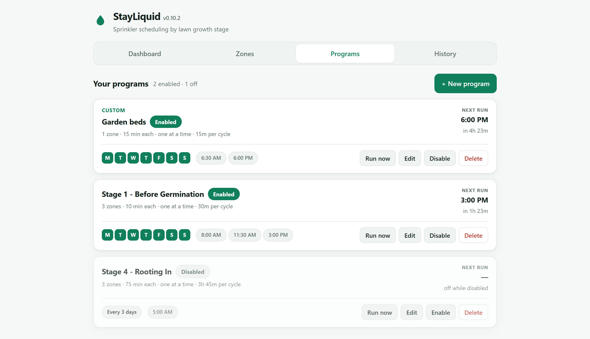

# StayLiquid

**Sprinkler scheduling for Home Assistant, built around how a lawn actually
grows.** Point it at the switches or valves that run your sprinklers, pick the
stage your grass is at, and StayLiquid waters it the right way. It starts with
little and often while seed is germinating, and moves to long, deep soaks once
the turf is established.

<picture>
  <source media="(prefers-color-scheme: dark)" srcset="docs/screenshots/dashboard-dark.png">
  
</picture>

## Features

### 📊 Today at a glance

The dashboard (above) shows today as a timeline with one lane per zone. You can
see what has watered, what is watering now, and what is still to come, with a
line marking the current time. A run that was cut short or failed shows in its
own colour, so an odd day stands out immediately. Underneath, each zone has a
switch, and tiles show the next cycle, how much water each zone has had today,
and the rain delay.

It follows your system's light or dark mode.

### 🌱 Presets for each growth stage

New seed needs its top layer kept damp all day. Established turf needs the
opposite, so its roots have to reach down for water. StayLiquid includes four
presets that take a lawn from bare seed to established turf. Picking one fills
in the whole schedule for every zone you have.

| Stage | When | Runtime per zone | How often | Water per cycle* |
|---|---|---|---|---|
| **1 · Before Germination** | Seed down, nothing sprouted yet | 10 min | 3× a day (8:00, 11:30, 15:00) | ~0.07" |
| **2 · Sprouting** | First green fuzz through ~week 3 | 15 min | 2× a day (8:00, 13:00) | ~0.10" |
| **3 · Young Grass** | Mowable but not established, ~weeks 3–8 | 40 min | Daily at 6:00 | ~0.27" |
| **4 · Rooting In** | Established turf, week 8 onward | 75 min | Every 3 days at 5:00 | ~0.50" |

*Estimated from a typical spray-zone rate of 0.4 in/hr.

Every number is only a starting point. Once a program is saved, you can edit
anything in it.

### 🗓️ A program builder that shows its working

A four-step guide takes you through stage, schedule, zones and review. The
review step shows exactly when each zone starts, in every cycle, and when the
whole cycle finishes. It warns you if one cycle would still be running when the
next is due. You also see how much water each zone gets per cycle and per
watering day, not just a number of minutes.

- **Several cycles a day**, each with its own start time.
- **Run on chosen weekdays**, or **every N days**.
- **Zones one after another** (keeps the pressure up) **or all at once**.
- A runtime for every zone, with **per-zone overrides**.

### 🚰 Switches that show the real valve

- **Shows the valve's actual state**, however it was opened: from StayLiquid,
  a Home Assistant dashboard, an automation, or by hand at the box.
- **Turning a zone on always runs it for a set time.** A switch with no timer
  is one forgotten tap away from watering all night.
- **Shows *Opening…* and *Closing…*** while a motorised valve is moving, instead
  of a switch that seems to ignore you.
- **Works with any `switch.*` or `valve.*` entity**: relay boards, smart valve
  controllers, or anything else Home Assistant already controls.

### 🌧️ Rain delay and pause

- **Rain delay** holds every scheduled program for 12, 24, 48 or 72 hours, or
  any number of hours you choose. Manual runs still work.
- **Pause watering** closes every open valve immediately, for when you need the
  water pressure indoors. A zone partway through a run keeps the time it still
  owes: six minutes into a twenty-minute run, it resumes with fourteen left. A
  pause ends on its own after two hours, so one left on by accident can't stop
  the lawn being watered indefinitely.

### 🧾 History that tells you what went wrong

Each program run appears as one card, split into numbered steps. If step 3
didn't finish, you can see that at a glance, along with the reason: switched
off in Home Assistant, zone unavailable, skipped for rain delay, and so on.
Anything that needs your attention is collected at the top until you mark it
as seen.

### 📋 Your programs at a glance

Each program shows the days it runs, its cycle times and when it will next run.
You can run, edit, disable or delete it straight from its card.

### 🛟 Built not to flood your yard

A watering controller has one job it must never get wrong: closing the valve.

- **Closing is retried** if Home Assistant doesn't respond. If it still fails,
  the run is logged as an error and a warning goes to the add-on log.
- **Valves left open by a crash or power cut are closed** the next time the
  add-on starts.
- **StayLiquid never reopens a valve someone closed.** A zone switched off
  outside the add-on ends its run within about a second, because Home Assistant
  pushes the change instead of the add-on polling for it.
- **A zone that's unavailable is skipped**, not "watered" into the void, and
  the rest of the program carries on.
- **Schedules run in Home Assistant's timezone**, so 6:00 means 6:00 where the
  lawn is.

## Install

**One click:** use the **Add repository** button at the top of this page. Or:

1. In Home Assistant: **Settings → Add-ons → Add-on Store → ⋮ (top right) → Repositories**
2. Add: `https://github.com/arobe14040/StayLiquid`
3. Find **StayLiquid** in the store, click **Install**, then **Start**.
4. Open it from the sidebar. It runs through Ingress, so there's no extra port
   or login to set up.

Then add your zones on the **Zones** tab and build your first program from a
growth stage.

See [`stayliquid/DOCS.md`](stayliquid/DOCS.md) for the details of how zones,
programs, presets, rain delay and pausing work.

## Requirements

- **Home Assistant OS or Supervised.** StayLiquid is a Supervisor add-on, so it
  doesn't run on Container or Core installs.
- One or more **`switch.*` or `valve.*` entities** that control your sprinkler
  valves (a relay board, a smart valve controller, and so on). Anything already
  in Home Assistant works.

## Status

Working, and actively being built. See the
[changelog](stayliquid/CHANGELOG.md) for what's new and
[`stayliquid/DOCS.md`](stayliquid/DOCS.md) for open items. Weather-based rain
delay is deliberately not implemented yet. For now, rain delay is manual
(12h/24h/48h/72h/custom buttons in the UI).
